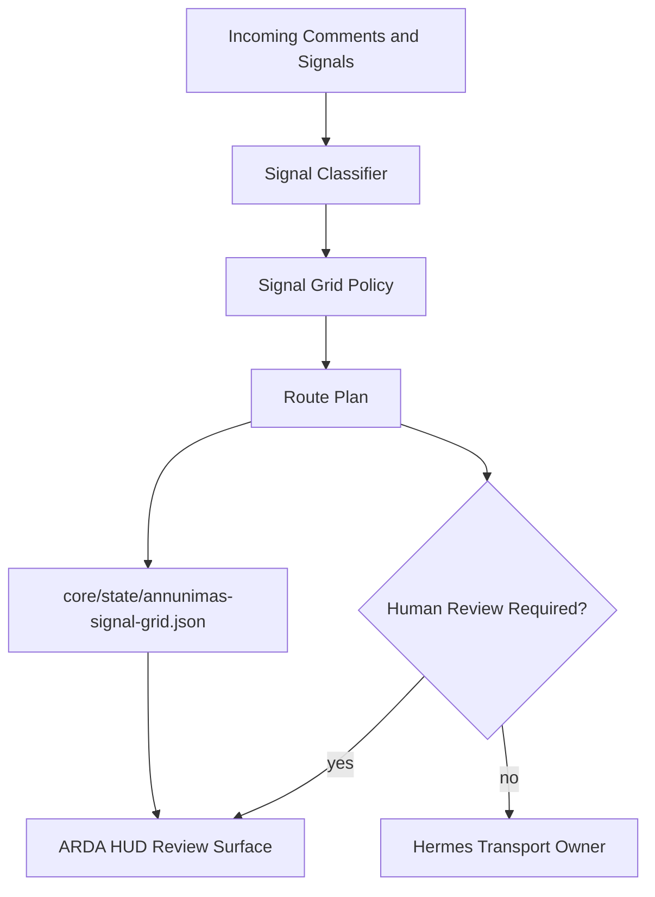

---
soterion:
  sigil: "SCROLL"
  glyph: "📜"
  code_point: "U+1F4DC"
  role: "documentation"
  owner: "HADES"
  status: "active"
  last_reviewed: "2026-05-21"
---

> 🜏 Soterion: 📜 documentation | owner: HADES | status: active | reviewed: 2026-05-21

# annunimas-signal-grid

Spawned from the Annunimas sovereign crate blueprint. This crate is currently a
projection-surface blueprint, not the live Hermes transport owner.

- Realm: `communications`
- Productizable: `true`
- Role: projection surface
- Required exports: `core/state/annunimas-signal-grid.json`
- Required hooks: task ledger, ARDA visibility, Soterion trace, governance validators, memory checkpoint capture

## Vision

`annunimas-signal-grid` is the communications projection surface for ARDA. It
turns comments, alerts, pauses, review requests, and escalation cues into
explicit route plans that an operator can inspect before an autonomous system
acts. The crate keeps Hermes as the live transport owner while giving ARDA a
stable contract for signal classification and governance-aware routing.

## Getting Started

```bash
cargo test
cargo doc --no-deps
```

Start with the baseline route-plan examples in `src/pipeline.rs`, then add
concrete classifiers and transport adapters outside the blueprint boundary.

## ARDA Architecture Role



## Baseline

This crate blueprint starts with:

- crate contract in `src/contract.rs`
- route-plan examples in `src/pipeline.rs`
- service status and governance baseline validation in `src/service.rs`
- governance smoke test in `tests/contract_smoke.rs`

Any new agentic crate should preserve this baseline rather than retrofitting governance, memory, and state-export posture later.

## Usage

```rust
use annunimas_signal_grid::pipeline::{CommentSignal, SignalGridPolicy};
use annunimas_signal_grid::service::plan_route;

let plan = plan_route(CommentSignal::NegativeSentiment, SignalGridPolicy::normal());

assert!(plan.human_review_required);
```

## Extension Points

- Add concrete signal classifiers before promoting beyond blueprint status.
- Keep Hermes as the live transport owner unless this crate gets a distinct runtime path.
- Preserve behavioral tests for routing, suppression, pause, full-stop, and alert transitions.
